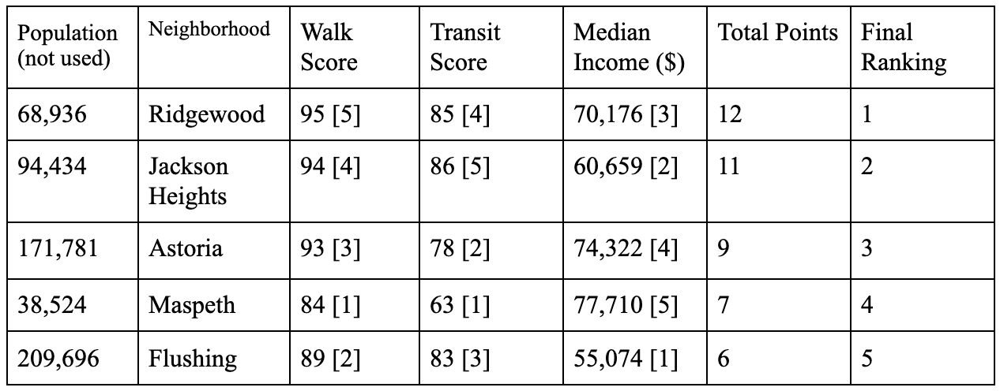
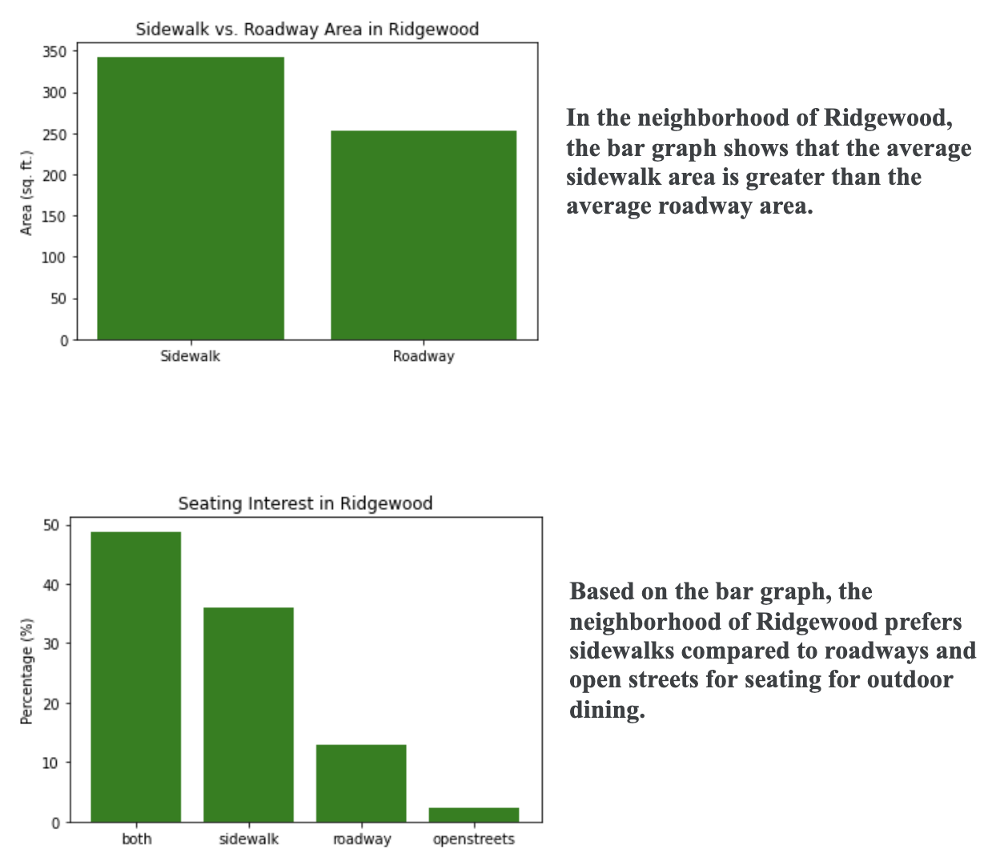

## Ridgewood


Located in western Queens, the neighborhood of Ridgewood is bordered by neighborhoods such as Bushwick and East Williamsburg to the west and Middle Village, Glendale, and Maspeth to the east. Ridgewood’s location along Myrtle Avenue alongside its immigrant population allows for a popular food scene. Its notorious side streets lined with arched, single-family houses with stoops have created an emphasis on family and community in Ridgewood. 

## Food Scene 

Ridgewood is home to 100+ cafes, bars, restaurants, and eateries that serve different cuisines such as Turkish, Mediterranean, Greek, Egyptian, Polish, Mexican, Indian, Himalayan, Italian, and Japanese.

```markdown
Basic Demographics & Statistics (as of 2019)

Total Population: 69, 428
  Male: 34,448 49.6%)
  Female: 34,980 (50.4%)
Race
  White: 80.2%
  Black or African American: 2.5%
  American Indian or Alaska Native: 0.2%
  Asian: 7.0%
  Some Other Race: 7.7%
  Two or More Races: 2.4%
Age
  Under 5 to 24 years: 32.3%
  25 to 64 years: 58.8%
  65 to 85 years and older: 8.9%

```

## Comparing Ridgewood to Other Neighborhoods of Queens



```
In order to determine how each of our Queens neighborhoods ranked in terms of desirability 
for outdoor dining, we compared each one using the following desirable qualities: walk 
score, transit score, and income. Walk Score measures how readily the residents of a 
neighborhood can access the restaurants. People walking around the neighborhood could spot 
the restaurants and decide to stay and eat. Transit Score measures how readily consumers 
outside the neighborhood can access the restaurants. People need to be able to access the 
restaurants easily if they hear about them through advertisements. Income  is used to 
determine the cost of living. This then indicates more opportunities for restaurants to 
operate and be supported. We first ranked each neighborhood by a criteria and awarded 1 
to 5 points (5 being the best and 1 being the worst). Then we totaled the points to 
determine a final ranking. For all metrics, walk score, transit score and median income, 
the higher the number is, the more points each neighborhood received. In terms of 
desirability of outdoor dining, our metrics indicate the following for our respective 
neighborhoods in Queens (from best to worst): Ridgewood, Jackson Heights, Astoria, Maspeth, 
Flushing. Ridgewood has the best balance of walkability, train access, and income to create 
an environment ideal for people to start restaurants that have outdoor dining while being 
easily accessible to people in and out of the area.
```

## Data Analysis of Ridgewood from Open Restaurants Data Set


## Interactive Map with Restaurant Markers

<dl>
<iframe src="HC10_Neighborhood_Map.html" width="600" height="400" frameborder="0" frameborder="0" marginwidth="0" marginheight="0" allowfullscreen></iframe>
</dl>

# Queens Borough Webpage 
[Queens Borough Webpage](https://nickyaoo.github.io/Queens/)
